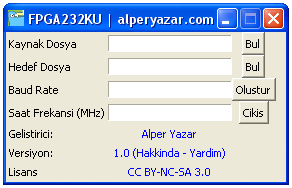

# FPGA232KU: FPGA RS 232 Kod Üretici v1.0

> :warning: Bu projeyi 2011 yılında, hobi amaçlı yapmıştım. Daha sonra da tekrar elden hiç geçirmedim. Repoyu hatıra amaçlı tutuyorum. Yazılımlardan çok bir beklentiniz olmasın.

Bu repo ile FPGA ile RS-232, RS-422 gibi protokollerde kullanılan seri iletişimi gerçekleştirmek için yazmış olduğum VHDL modülünü ve bu modülü, kullanılan FPGA'in clock frekansına ve seri iletişimde tercih edilen baud rate değerine göre ayarlamak için yazmış olduğum ufak bir bilgisayar programını tanıtmak istiyorum.

Kullandığınız FPGA'in bazı nedenlerden dolayı bir UART modülüne sahip olmasını isteyebilirsiniz. FPGA'ler, mikrokontrolcülerde olduğu gibi UART, ADC gibi çeşitli donanımsal modüllere sahip olmuyorlar. (En azından benim bildiğim FPGAlerde böyle donanımlar yok.) Fakat, UART gibi bazı modülleri HDL (Verilog, VHDL gibi) kullanarak FPGA içine koymak mümkün.

Ben de çalışmalarımda kullanmak için VHDL dilinde basit bir UART modülü yazdım. Bu UART modülü birbirinden bağımsız şekilde gönderme ve alma işlemleri yapabiliyor. FPGA'in mikrokontrolcülere göre belki de en büyük artısı, fiziksel yapısından dolayı bu tarz paralleliklere izin verebilmesi. Yani veri gönderirken, dinleme yapabiliyorsunuz.

Modül ile kullandığınız clock hızına bağlı olarak yüksek baud rate değerlerinde haberleşme yapabilmek mümkün. Birçok FPGA'in minimum 10 - 25 MHz gibi frekanslarda çalıştığını düşünürsek, 115200 baud rate gibi RS-232'ye göre yüksek hızlarda haberleşme yapılabilir.RS-232, elektronik ile uğraşan birçok kişinin tanıdığı bir protokoldür. Eğer FPGA'in çıkışını, RS-232 için uygun bir çevirici devreye takarsanız, bu modülü FPGA'i bilgisayar ile haberleştirmek için kullanabilirsiniz. Eğer siz de benim gibi bir FPGA geliştirme kartı kullanıyorsanız, kullandığınız kartta zaten bu iş için konulmuş ve FPGA'e bağlanmış bir entegre bulunabilir. Örneğin benim üzerinde çalıştığım Altera DE0 kartında böyle bir entegre bulunuyor. Dolayısı ile ekstra herhangi bir donanım kullanmadan, FPGA ile bilgisayarı seri port üzerinden konuşturmak mümkün olabiliyor.

> :warning: Eğer FPGA'nize bağlı herhangi bir çevirici devre/entegre bulunmuyor ise, RS-232 protokolü gereğince haberleşme hattında bulunabilecek -15, + 15 V arası potansiyeller, bilgisayarınızdan aldığınız seri port hattını direkt olarak FPGA pinlerine bağlamanız taktirde FPGA'e zarar verebilir.

Bu yazıdaki amacım seri haberleşmeyi anlatmak olmadığı için protokolden bahsetmeyeceğim.

Yazdığım modülün genel yapısına bakacak olursak:

*FPGA232KU v1.0 Modül Diyagramı*

Görüldüğü üzere, modülün çeşitli giriş ve çıkışları bulunmaktadır. Şimdi, bu giriş/çıkışlardan bahsetmek istiyorum. İlk olarak veri gönderme işleminden bahsedeceğim.

## Verici Kısım

* `clk`: Modülün kullandığı clock sinyalidir. Bu pin direkt olarak FPGA'i çalıştırdığınız clock'a veya FPGA içerisinde bölüp, oluşturmuş olduğunuz başka bir clock sinyaline bağlanabilir. **FPGA232KU** yazılımında belirtilmesi gereken değer buraya bağlanan sinyalin frekans değeridir. Modül işlemleri, bu sinyalin yükselen kenarında yapmaktadır. Birbirinden bağımsız çalışan alıcı ve verici kısmın tek ortak noktası, her ikisinin de clock olarak bu sinyali kullanıyor olmasıdır.
* `tx_veri [7:0]`: Modülün seri iletişim ile göndereceği bilgi bu bus yardımıyla iletilir. Modül, bir byte bilgiyi kendi tamponunda tutabilmektedir. `tx_veri[7]` biti gönderilecek bilginin MSB'sini içerirken, `tx_veri[0]`'da gönderilecek bilginin LSB'si bulunur. Eğer modül, henüz veri gönderme işlemini tamamlamamışsa bu veriye bakmamaktadır. Modül, en son yüklenen veriyi gönderdikten sonra bu girişe bakar. Veri gönderme işlemi bittikten sonra `yeni_veri_gonderilebilir` çıkışı 1 yapılmaktadır. Bu esnada, adından da anlaşılabileceği gibi yeni bir veri seri kanal üzerinden gönderilebilir. `yeni_veri_gonderilebilir` çıkışı 1 iken, `tx_basla` girişi 1 yapılır ise, modül `clk` sinyalinin ilk yükselen kenarında `tx_veri[7:0]` girişindeki veriyi kendi tamponuna yazar ve seri kanaldan göndermeye başlar. Aynı anda `yeni_veri_gonderilebilir` çıkışı kullanıcıya aktif bir gönderme işlemi olduğunu ve tamponun yazılabilir olmadığını belirtmek için 0 konumuna çekilir. Sonuç olarak, `tx_veri[7:0]` girişindeki veri, `tx_basla` girişi 1'e çekildikten sonra `yeni_veri_gonderilebilir` çıkışı 0 olana kadar sabit tutulmalıdır. Bu noktadan sonra bu girişin içeriğinin değiştirilmesi giden veriyi etkilemez. Çünkü `yeni_veri_gonderilebilir` çıkışının modül tarafından 0'a çekilmesi, gönderilmek istenen verinin modül tamponuna yazıldığını göstermektedir.
* `tx_basla`: Bu giriş, kullanıcı tarafından 1 yapılırsa ve modülün gönderme kısmı boşta ise yani `yeni_veri_gonderilebilir` çıkışı 1 ise, `clk` sinyalinin ilk yükselen kenarında `tx_veri[7:0]` bilgisi modüldeki tampona yazılır ve seri kanaldan gönderilir. Bu giriş, veri gönderimini başlatmak için kullanılan bir giriştir. Dikkat edilmesi gereken nokta, eğer aynı veriyi tekrar göndermek istemiyorsak gönderme kısmı veri göndermeyi bitirene kadar `tx_basla` sinyalini 0'a çekmektir. Aksi taktirde, veri gönderimi biter bitmez `tx_basla` sinyali 1 olarak algılanacağı için o esnada `tx_veri[7:0]`'ın değeri tekrar gönderilmeye başlanır. `tx_basla`'nın tekrarlı veri gönderimi istenmediği durumda 0'a çekilmesinin uygun olduğu zamanlardan biri, `yeni_veri_gonderilebilir` çıkışının düşen kenarıdır.
* `yeni_veri_gonderilebilir`: Bu çıkış, modülün gönderme kısmı yeni bir veri göndermeye uygun ise 1 yapılmaktadır. Kullanıcı bu sinyalin 1 olmasını kontrol edip, yeni bir veri gönderme işlemini başlatabilir. `yeni_veri_gonderilebilir` sinyalinin 0 olması, modülün o esnada en son yüklenen veriyi seri kanaldan göndermekle meşgul olduğunu gösterir. Bu esnada `tx_veri [7:0]` ve `tx_basla` girişlerinin değerlerinin bir anlamı yoktur.
* `tx`: Modülün seri iletişim ile veri gönderdiği çıkışıdır.

### Örnek

İsterseniz bu modülü kullanarak, bir kaç byte'ı nasıl gönderebileceğimize bir bakalım.

İlk olarak bir byte göndermeden önce `yeni_veri_gonderilebilir` çıkışını kontrol ediyoruz. Bu çıkış 0 ise zaten gönderme yapamayız. Bu çıkışın 1 olmasını beklediğimizi var sayalım. Bu esnada istersek ön hazırlık olarak `tx_veri [7:0]`'a istediğimiz bilgiyi koyabiliriz. Farz edelim ki belirli bir süre sonra `yeni_veri_gonderilebilir` çıkışını 1 olarak yakaladık. Eğer beklerken `tx_veri[7:0]` girişini göndermek istediğimiz bilgiye ayarlamadıysak, şimdi göndermek istediğimiz byte büyüklüğündeki veriyi, bu girişe eşitleyebiliriz. `tx_veri [7:0]` girişini istediğimiz şekilde ayarladıktan sonra, `tx_basla` sinyalini 1 yapıyoruz. Modül, bizim başla dediğimizi anladığı zaman göndermek istediğimiz veriyi kendi tamponuna yazacak ve `yeni_veri_gonderilebilir` çıkışını 0'a çekerek bize meşgul olduğunu bildirecektir. Eğer gönderdiğimiz byte gittikten sonra hemen bir veri daha göndermek istiyorsak bu esnada yeni verimizi hazırlayabiliriz. Modülün `yeni_veri_gonderilebilir` çıkışını 0'a çekmesini algıladıktan sonra biz de `tx_basla` sinyalini 0'a çekiyoruz. Bu esnada göndereceğimiz bir sonraki veriyi hesaplayıp, `tx_veri [7:0]` girişine yazabiliriz. Şu noktada eminiz ki, en son yazdığımız veri gönderilene kadar süremiz var. Bu da kullandığınız `clk` frekansına ve baud rate değerine göre binlerce clock çevrimine denk gelebilir. Yani yeni veriyi hesaplamak için bolca süremiz var. Bir sonraki verimizi hesaplayıp, `tx_veri [7:0]`'a yazdığımızı var sayalım. Artık, biz yeni veri göndermeye hazırız fakat modülümüz henüz en son yazdığımız veriyi göndermeyi bitirmemiş. Bundan dolayı `yeni_veri_gonderilebilir` çıkışı hala 0. Yapabileceğimiz tek şey, bu çıkışın 1 olmasını beklemek. Bu çıkışı 1 yakaladığımız an paragrafın başındaki prosedürleri tekrarlamaya başlayabiliriz.

Bu şekilde ard arda veri gönderilebilir. Burada iki veri gönderimi arasındaki süreyi belirleyecek nokta kullandığımız clock sinyalinin frekansının / baud rate değerine oranı olacaktır. Eğer bu oran ne kadar yüksek ise, iki veri gönderimi arasında o kadar çok işlem yapabiliriz demektir. Tabii, bir veri gönderiminden sonra hemen ikincisini göndermeniz gerekmiyor. Asenkron bir iletişim olduğu için istenilen süre kadar beklenebilir. Eski veri giderken, yenisini hazırlayamamak ve bitişine yetiştirememek o kadar problem değil.

Modülün verici kısmı, 8 bitlik verileri parity bit eklemeden, istenilen baud rate değerinde, 1 start bit'i ve 2 stop bit'i kullanarak göndermektedir. Genellikle tek stop bit'i kullanılmasına karşılık, [burada](http://www.fpga4fun.com/SerialInterface1.html) karşılaştığım bilgi üzerine 2 stop bit'i kullanmaya karar verdim. Fakat, stop bit sayısını verdiğim VHDL kodunu değiştirerek değiştirebilirsiniz. Veya modülün başka bir sürümünü ileride yayınlarsam, ben de kullanıcının kaç stop bit'i olacağını seçmesine olanak sağlayabilirim. :) 2 stop bit'i kullanılması, sadece maksimum veri iletim hızını düşürecektir. Örneğin, bilgisayarda kullanılan Hyper Terminal gibi programların çalışmasını etkilemez.

## Alıcı Kısım

* `clk`: Verici kısımdaki sinyal ile aynıdır. Yukarıdaki açıklamayı okuyabilirsiniz.
* `rx_veri [7:0]`: Modülün alıcı kısmının, `rx` girişi ile gelen seri bilgiden aldığı bilgidir. `rx_veri[7]` bitinde alınan verinin MSB'si tutulurken, `rx_veri[0]` bitinde LSB tutulur. Bu 8 bitlik veri, modülün aldığı son bilgiyi tutmaktadır. Modül, yeni ve geçerli bir bilgi alana kadar en son alınan değeri tutar. Modül, aldığı verinin geçerli olup, olmadığını kontrol etmektedir. Eğer, start ve stop bitleri olması gereken değerde değil ise, `rx_veri[7:0]` çıkışındaki değer güncellenmez. Bu da veri iletim hatalarının kısmen önüne geçmektedir.
* `alinan_veri_gecerli`: Bu çıkış, modülün yeni bir veri aldığını çağırıldığı üst modüle bildirmek için kullanılır. Bir üst modülde, bu sinyalin yükselen kenarına bakılmalıdır. Sinyalin yükselen kenarı algılandığı zaman, `rx_veri[7:0]` hattı alınan son geçerli veriyi içermektedir. `alinan_veri_gecerli` sinyalinin bir sonraki yükselen kenarına kadar bu değer korunur.
* `rx`: Modülün seri iletişim ile veri aldığı girişidir.

### Örnek

Alıcı kısmın kullanımı, verici kısma göre kısmen daha kolayıdır. `rx_veri[7:0]`'daki değeri okumadan önce her zaman `alinan_veri_gecerli` çıkışının yükselen kenarına bakmalıyız. Yükselen kenarı yakaladığımız zaman, `rx_veri[7:0]`'daki değeri kullanmak için ana modüldeki bir tampona yazabiliriz. Yeni veriyi kullanmak için yine `alinan_veri_gecerli` sinyalinin yükselen kenarını beklemeliyiz.

Alıcı kısım, gelen 8 bitlik bilginin 1 start biti, 1 stop biti ile parity bit eklenmeden geldiğini var sayar. Fakat, 2 stop biti kullanılması bir soruna yol açmaz. Örneğin iki farklı FPGA üzerine bu modül çalışıyor ise, iki FPGA sağlıklı bir şekilde haberleşebilir. Verici kısmın 2 adet stop biti kullanması haberleşmede problem oluşturmaz. Her ne kadar FPGA232KU yazılımı, alıcı ve verici kısmın baud rate değerini aynı kabul edip, bir kod üretse de kaynak kodunda değişiklik yaparak alıcı ve verici kısmın farklı baud rate değerlerinde çalışması sağlanabilir.

> :information_source: Alıcı kısım, asenkron veri alımı yaptığından, oluşabilecek metastability problemlerini azaltmak için shift register kullanılarak yapılmış bir tampon kullanmaktadır.

## FPGA232KU

*FPGA232KU Versiyon: 1.0*

Buraya kadar her şey güzel. Fakat modül içerisindeki kodların, çalıştığımız clock hızı ve seçtiğimiz baud rate değerine göre hazırlanması gerekmektedir. Bu çok zor bir işlem olmasa da, hem hata yapma ihtimalini azaltma hem de farklı clock/baud rate değerlerine geçişleri hızlandırmak adına ufak bir bilgisayar programı yazmaya karar verdim. Adını da FPGA232KU, **FPGA RS 232 Kod Üretici** (İlk akla gelen isimle ancak bu kadar yaratıcı olunabiliyor. :D ) koydum. Programın yaptığı şey, girilen clock ve baud rate değerlerine uygun olacak şekilde modülü üretmek. Çok karmaşık bir işlem olmadığı için belki VHDL ile de bir şekilde parametrik programlama yaparak çözüm üretilebilirdi. Veya nasıl yazıldığını biliyor olsaydım bir IP Core şeklinde de yayınlanabilirdi. Ben de bu bahane ile sürekli ertelediğim Python ve GUI işlerini kullanmak istedim. Sonuçta ortaya Python ve Tkinter kullanarak hazırlanmış minik bir program çıktı. Programın kaynak kodunu ve Windows üzerinde direkt çalıştırılabilecek .exe halini indirebilirsiniz. Python ile yazdığımdan dolayı Python desteği sunan Linux gibi işletim sistemlerinde gerekli kütüphaneler sağlandığı sürece sorunsuz çalışması gerekmektedir. Böylece FPGA232KU'yu, Cross Platform bir yazılım olarak sunmaktayım. :)

### Nasıl Kullanılacak?

Programın kullanımı oldukça basit. `FPGA232KU_v1.0_alperyazar.com.zip` isimli dosyayı indirdiğiniz zaman, programın yanı sıra bir adet `.template` uzantılı bir adet de `.vhd` uzantılı bir dosya çıkacaktır. `.template` uzantılı dosya, modülün aslında kendisidir. Fakat kullanılacak clock ve baud rate değerine göre değiştirilecek yerler FPGA232KU'nun anlayabileceği şekilde bırakılmıştır. Programı çalıştırdığınız zaman (direkt .exe dosyasını veya Python kodunu) yukarıdaki ekran çıkacaktır. Burada `Kaynak Dosya` alanına `.template` uzantılı dosyayı, `Hedef Dosya` alanına da `.vhd` dosyasını göstermelisiniz. Daha sonra, modülün `clk` girişini vermeyi planladığınız sinyalin frekansını, ki FPGA'i çalıştırdığınız clock olabilir, `Saat Frekansı` alanına MHz cinsinden, haberleşmede kullanmak istediğiniz baud rate değerini de `Baud Rate` kutusuna yazmalısınız. Son olarak `Oluştur` düğmesine bastığınız zaman eğer bir hata almadıysanız ve başarı mesajını gördüyseniz, seçtiğiniz `.vhd` dosyasına uygun kodlar üretilmiş olacaktır. Bu dosyayı kendi projenize dahil edebilirsiniz.

Yazılımın kullanımı ayrıca aşağıdaki [videoda](https://www.youtube.com/watch?v=3lK4e6HhqBg) da gösterilmektedir.

Bir sonraki bölümü okuyarak, FPGA232KU'nun benim oluşturduğum şablon (`.template`) dosyası dışındaki dosyalar ile çalışmasını sağlayabilirsiniz. Örneğin kodu Verilog dili için uyarlayabilir veya kodu değiştirebilirsiniz. Değişiklik yapılırken sadece, belirtilen lisans koşullarına uyulmasını rica ediyorum.

### Programın Çalışması

FPGA232KU'nun yaptığı iş, şablon dosyasındaki bazı özel kelimeleri, hesapladığı değerlerle değiştirmektir. Python bilmiyor olsanız bile biraz programlama dilleri ile uğraşmışsanız, Python kodunu inceleyerek neyin ne ile değiştirildiğini anlayabilirsiniz. Ben yine de burada şablon dosyasındaki özel kelimelerden ve FPGA232KU'nun işlem sonrası yerine koydu değerlerden kısaca bahsetmek istiyorum.

* `##$clk_frekansi$##`: Kullanıcının, `Saat Frekansı` alanına girdiği değeri içerir.
* `##$baud_rate_degeri$##`: Kullanıcının, `Baud Rate` alanına girdiği değeri içerir.
* `##$bekleme_vektoru_ust_bit_indeksi$##`: `Saat Frekansı` * 1e6 / `Baud Rate` sonucunun tam sayıya yuvarlanmış halinin, 2 lik tabandaki karşılığının, basamak sayısının bir eksiğini tutar.
* `##$bekleme_vektoru_siniri$##`: `Saat Frekansı` * 1e6 / `Baud Rate` sonucunun tam sayıya yuvarlanmış halinin, 2 lik tabandaki karşılığını tutar.
* `##$rx_bekleme_vektoru_ilk_deger$##`: `##$bekleme_vektoru_siniri$##`'nin sahip olduğu sayının bir basamak sağa kaydırılmış ve başına 0 eklenmiş değerini tutar.

Şablon dosyasında bu anahtar kelimelerin olduğu yerde, FPGA232KU programının ürettiği dosyada karşılığında yazan değerler olacaktır. Bundan dolayı şablon dosyası rahat bir şekilde değiştirilebilir.

## Son Sözler

Bu repoda, FPGA ile seri haberleşme yapmak için VHDL dilinde yazmış olduğum bir UART modülünden, bu modülün kullanılmasından ve farklı clock/baud rate değerlerinde hızlı, güvenilir bir şekilde modül kodunun güncellemesini yapabilecek yazmış olduğum FPGA232KU adlı minik yazılımdan bahsettim. Yazmış olduğum modülde ve özellikle FPGA232KU yazılımda iyileştirme yapılabilecek bir çok nokta olabilir ve iki kod da bir çok hata barındırıyor olabilir. Bu açıdan, yazdığım modülü ve yazılımı kullanıp kullanmamak tamamen size kalmıştır. Sonra buraya geri dönüş olarak "Senin koduna güvendik, iki karakter bile gönderemiyor bu modül!" şeklinde sitem içerikli yorumlar lütfen göndermeyiniz. :) Şaka bir yana, gördüğünüz bir eksikliği, "Şurası şöyle olsa daha iyi olur." dediğiniz bir noktayı iletirseniz çok mutlu olurum. Ayrıca sorularınızı da buradan iletebilirsiniz. Bahsi geçen programları tek paket olarak hemen aşağıdan indirebilirsiniz.

Uygun olduğum bir zaman bu modülü kullanarak örnek bir uygulama hazırlayıp, paylaşmayı düşünüyorum.

## Dosyalar

İndireceğiniz dosyanın içerdiği tüm dosyalar [CC BY-NC-SA 3.0](LICENSE) lisansı ile sunulmaktadır. Dosyayı indirmeden önce bir hatırlatmak istedim. Lisans koşullarına uyulması beni mutlu edecektir.

[Buradan](FPGA232KU_v1.0_alperyazar.com.zip) indirebilirsiniz.
